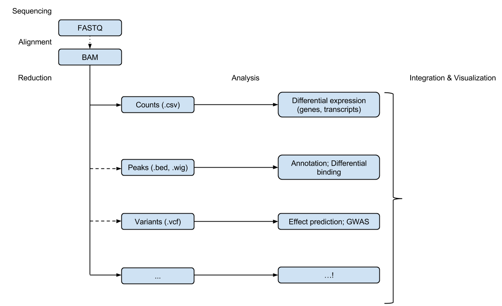

```{r style, echo = FALSE, results = 'asis'}
BiocStyle::markdown()
options(width=100, max.print=1000)
knitr::opts_chunk$set(
    eval=as.logical(Sys.getenv("KNITR_EVAL", "TRUE")),
    cache=as.logical(Sys.getenv("KNITR_CACHE", "TRUE")))
```

```{r setup, echo=FALSE}
suppressPackageStartupMessages({
    library(GenomicRanges)
    library(SummarizedExperiment)
})
```

- Familiarity with _R_. The diversity of analysis challenges addressed
  by _Bioconductor_. The role of _Bioconductor_ packages in specific
  work flow steps. _Bioconductor_ resources for help and effective
  use. Primary packages: [GenomicRanges][], [SummarizedExperiment][].

# Interactivity: Sequence analysis work flows

1. Experimental design
    - Keep it simple, e.g., 'control' and 'treatment' groups
    - Replicate within treatments!
2. Wet-lab sequence preparation (figure from http://rnaseq.uoregon.edu/)

    
    
    - Record covariates, including processing day -- likely 'batch effects'

3. (Illumina) Sequencing (Bentley et al., 2008,
   doi:10.1038/nature07517

    

    - Primary output: FASTQ files of short reads and their [quality
      scores](http://en.wikipedia.org/wiki/FASTQ_format#Encoding)

4. Alignment
    - Choose to match task, e.g., [Rsubread][], Bowtie2 good for ChIPseq,
      some forms of RNAseq; BWA, GMAP better for variant calling
    - Primary output: BAM files of aligned reads
5. Reduction
    - e.g., RNASeq 'count table' (simple spreadsheets), DNASeq called
      variants (VCF files), ChIPSeq peaks (BED, WIG files)
6. Analysis
    - Differential expression, peak identification, ...
7. Comprehension
    - Biological context



# Interactivity: _R_ 

Language and environment for statistical computing and graphics

- Full-featured programming language
- Interactive and *interpretted* -- convenient and forgiving
- Coherent, extensive documentation
- Statistical, e.g. `factor()`, `NA`
- Extensible -- CRAN, Bioconductor, github, ...

Vector, class, object

- Efficient _vectorized_ calculations on 'atomic' vectors `logical`,
  `integer`, `numeric`, `complex`, `character`, `byte`
- Atomic vectors are building blocks for more complicated _objects_
  - `matrix` -- atomic vector with 'dim' attribute
  - `data.frame` -- list of equal length atomic vectors
- Formal _classes_ represent complicated combinations of vectors,
  e.g., the return value of `lm()`, below

Function, generic, method

- Functions transform inputs to outputs, perhaps with side effects,
  e.g., `rnorm(1000)`
  - Argument matching first by name, then by position
  - Functions may define (some) arguments to have default values
- _Generic_ functions dispatch to specific _methods_ based on class of
  argument(s), e.g., `print()`. 
- Methods are functions that implement specific generics, e.g.,
  `print.factor`; methods are invoked _indirectly_, via the generic.

Introspection

- General properties, e.g., `class()`, `str()`
- Class-specific properties, e.g., `dim()`

Help

- `?print`: help on the generic print 
- `?print.data.frame`: help on print method for objects of class
    data.frame.

Example

```{r}
x <- rnorm(1000)                   # atomic vectors
y <- x + rnorm(1000, sd=.5)
df <- data.frame(x=x, y=y)         # object of class 'data.frame'
plot(y ~ x, df)                    # generic plot, method plot.formula
fit <- lm(y ~x, df)                # object of class 'lm'
methods(class=class(fit))          # introspection
```

## Lab exercise: common data transformations


This case study servers as a refresher / tutorial on basic input and
manipulation of data.

Input a file that contains ALL (acute lymphoblastic leukemia) patient
information

```{r echo=FALSE}
fname <- "ALLphenoData.tsv"   # path to fle
stopifnot(file.exists(fname))
pdata <- read.delim(fname)
```

Check out the help page `?read.delim` for input options, and explore
basic properties of the object you've created, for instance...

```{r ALL-properties}
class(pdata)
colnames(pdata)
dim(pdata)
head(pdata)
summary(pdata$sex)
summary(pdata$cyto.normal)
```

Remind yourselves about various ways to subset and access columns of a
data.frame

```{r ALL-subset}
pdata[1:5, 3:4]
pdata[1:5, ]
head(pdata[, 3:5])
tail(pdata[, 3:5], 3)
head(pdata$age)
head(pdata$sex)
head(pdata[pdata$age > 21,])
```

It seems from below that there are 17 females over 40 in the data
set. However, some individuals have `NA` for the age and / or sex, and
these `NA` values propagate through some computations. Use `table()`
to summarize the number of females over 40, and the number of samples
for which this classification cannot be determined. When _R_
encounters an `NA` value in a subscript index, it introduces an `NA`
into the result. Observe this behavior (rows of `NA` values introduced
into the result) when subsetting using
`[` with the behavior of the `subset()` function.

```{r ALL-subset-NA}
idx <- pdata$sex == "F" & pdata$age > 40
table(idx, useNA="ifany")
dim(pdata[idx,])
dim(subset(pdata, idx))
```

Use the `mol.biol` column to subset the data to contain just
individuals with 'BCR/ABL' or 'NEG', e.g.,

```{r ALL-BCR/ABL-subset}
bcrabl <- pdata[pdata$mol.biol %in% c("BCR/ABL", "NEG"),]
```

The `mol.biol` column is a factor, and retains all levels even after
subsetting. It is sometimes convenient to retain factor levels, but in
our case we use `droplevels()` to removed unused levels

```{r ALL-BCR/ABL-drop-unused}
bcrabl$mol.biol <- droplevels(bcrabl$mol.biol)
```

The `BT` column is a factor describing B- and T-cell subtypes

```{r ALL-BT}
levels(bcrabl$BT)
```

How might one collapse B1, B2, ... to a single type B, and likewise
for T1, T2, ..., so there are only two subtypes, B and T? One strategy
is to replace two-letter level (e.g., `B1`) with the single-letter
level (e.g., `B`). Do this using `substring()` to select the first
letter of level, and update the previous levels with the new value
using `levels<-`.

```{r ALL-BT-recode}
table(bcrabl$BT)
levels(bcrabl$BT) <- substring(levels(bcrabl$BT), 1, 1)
table(bcrabl$BT)
```

Use `xtabs()` (cross-tabulation) to count the number of samples with
B- and T-cell types in each of the BCR/ABL and NEG groups

```{r ALL-BCR/ABL-BT}
xtabs(~ BT + mol.biol, bcrabl)
```

Use `aggregate()` to calculate the average age of males and females in
the BCR/ABL and NEG treatment groups.

```{r ALL-aggregate}
aggregate(age ~ mol.biol + sex, bcrabl, mean)
```

Use `t.test()` to compare the age of individuals in the BCR/ABL versus
NEG groups; visualize the results using `boxplot()`. In both cases,
use the `formula` interface. Consult the help page `?t.test` and re-do
the test assuming that variance of ages in the two groups is
identical. What parts of the test output change?

```{r ALL-age}
t.test(age ~ mol.biol, bcrabl)
boxplot(age ~ mol.biol, bcrabl)
```

# Presentation: _Bioconductor_

## Project tour

Analysis and comprehension of high-throughput genomic data

- Statistical analysis: large data, technological artifacts, designed
  experiments; rigorous
- Comprehension: biological context, visualization, reproducibility
- High-throughput
    - Sequencing: RNASeq, ChIPSeq, variants, copy number, ...
    - Microarrays: expression, SNP, ...
    - Flow cytometry, proteomics, images, ...

Packages, vignettes, work flows

- 1104 software packages; also...
    - 'Annotation' packages -- static data bases of identifier maps,
      gene models, pathways, etc; e.g., [TxDb.Hsapiens.UCSC.hg19.knownGene][]
    - 'Experiment packages -- data sets used to illustrate software
      functionality, e.g., [airway][]
- Discover and navigate via [biocViews][]
- Package 'landing page'
    - Title, author / maintainer, short description, citation,
      installation instructions, ..., download statistics
- All user-visible functions have help pages, most with runnable
  examples
- 'Vignettes' an important feature in Bioconductor -- narrative
  documents illustrating how to use the package, with integrated code
- 'Release' (every six months) and 'devel' branches
- [Support site](https://support.bioconductor.org);
  [videos](https://www.youtube.com/user/bioconductor), [recent
  courses](http://bioconductor.org/help/course-materials/)

Objects

- Example: [Biostrings][]

    ```{r}
    library(Biostrings)
    data(phiX174Phage)
    phiX174Phage
    letterFrequency(phiX174Phage, c("A", "C", "G", "T"))
    letterFrequency(phiX174Phage, "GC", as.prob=TRUE)
    ```

- Represent complicated data types
- Foster interoperability
- S4 object system
    - Introspection: `methods()`, `getClass()`, `selectMethod()`
    - 'accessors' and other documented functions / methods for
      manipulation, rather than direct access to the object structure
- Interactive help
    - `method?"substr,<tab>"` to select help on methods,
      `class?D<tab>` for help on classes

## A sequence analysis package tour

This very open-ended topic points to some of the most prominent
Bioconductor packages for sequence analysis. Use the opportunity in
this lab to explore the package vignettes and help pages highlighted
below; many of the material will be covered in greater detail in
subsequent labs and lectures.

Basics 

- Bioconductor packages are listed on the [biocViews][] page. Each
  package has 'biocViews' (tags from a controlled vocabulary)
  associated with it; these can be searched to identify appropriately
  tagged packages, as can the package title and author.
- Each package has a 'landing page', e.g., for
  [GenomicRanges][]. Visit this landing page, and note the
  description, authors, and installation instructions. Packages are
  often written up in the scientific literature, and if available the
  corresponding citation is present on the landing page. Also on the
  landing page are links to the vignettes and reference manual and, at
  the bottom, an indication of cross-platform availability and
  download statistics.
-   A package needs to be installed once, using the instructions on the
    landing page. Once installed, the package can be loaded into an R
    session

    ```{r require}
    library(GenomicRanges)
    ```
    
    and the help system queried interactively, as outlined above:

    ```{r help, eval=FALSE}
    help(package="GenomicRanges")
    vignette(package="GenomicRanges")
    vignette(package="GenomicRanges", "GenomicRangesHOWTOs")
    ?GRanges
    ```
    
Domain-specific analysis -- explore the landing pages, vignettes, and
reference manuals of two or three of the following packages.

- Important packages for analysis of differential expression include
  [edgeR][] and [DESeq2][]; both have excellent vignettes for
  exploration. Additional research methods embodied in Bioconductor
  packages can be discovered by visiting the [biocViews][] web page,
  searching for the 'DifferentialExpression' view term, and narrowing
  the selection by searching for 'RNA seq' and similar.
- Popular ChIP-seq packages include [csaw][] and [DiffBind][] for
  comparison of peaks across samples, [ChIPQC][] for quality
  assessment, and [ChIPseeker][] for annotating results (e.g.,
  discovering nearby genes). What other ChIP-seq packages are listed
  on the [biocViews][] page?
- Working with called variants (VCF files) is facilitated by packages
  such as [VariantAnnotation][], [VariantFiltering][], [ensemblVEP][],
  and [SomaticSignatures][]; packages for calling variants include,
  e.g., [h5vc][] and [VariantTools][].
- Several packages identify copy number variants from sequence data,
  including [cn.mops][]; from the [biocViews][] page, what other copy
  number packages are available? The [CNTools][] package provides some
  useful facilities for comparison of segments across samples.
- Microbiome and metagenomic analysis is facilitated by packages such
  as [phyloseq][] and [metagenomeSeq][].
- Metabolomics, chemoinformatics, image analysis, and many other
  high-throughput analysis domains are also represented in
  Bioconductor; explore these via biocViews and title searches.
  
Working with sequences, alignments, common web file formats, and raw
data; these packages rely very heavily on the [IRanges][] /
[GenomicRanges][] infrastructure that we will encounter later in the
course.

- The [Biostrings][] package is used to represent DNA and other
  sequences, with many convenient sequence-related functions. Check
  out the functions documented on the help page `?consensusMatrix`,
  for instance. Also check out the [BSgenome][] package for working
  with whole genome sequences, e.g., `?"getSeq,BSgenome-method"`
- The [GenomicAlignments][] package is used to input reads aligned to
  a reference genome. See for instance the `?readGAlignments` help
  page and `vigentte(package="GenomicAlignments",
  "summarizeOverlaps")`
- [rtracklayer][]'s `import` and `export` functions can read in many
  common file types, e.g., BED, WIG, GTF, ..., in addition to querying
  and navigating the UCSC genome browser. Check out the `?import` page
  for basic usage.
- The [ShortRead][] and [Rsamtools][] packages can be used for
  lower-level access to FASTQ and BAM files, respectively. Explore the
  [ShortRead vignette](http://bioconductor.org/packages/release/bioc/vignettes/ShortRead/inst/doc/Overview.pdf)
  and Scalable Genomics labs to see approaches to effectively
  processing the large files.

Visualization

- The [Gviz][] package provides great tools for visualizing local
  genomic coordinates and associated data. 
- [epivizr][] drives the [epiviz](http://epiviz.cbcb.umd.edu/) genome
  browser from within R; [rtracklayer][] provides easy ways to
  transfer data to and manipulate UCSC browser sessions.
- Additional packages include [ggbio][], [OmicCircos][], ...


# Interactivity: Key _Bioconductor_ packages and classes

## _GenomicRanges_


### Range operations


Ranges

- IRanges
    - `start()` / `end()` / `width()`
    - List-like -- `length()`, subset, etc.
    - 'metadata', `mcols()`
- GRanges
    - 'seqnames' (chromosome), 'strand'
    - `Seqinfo`, including `seqlevels` and `seqlengths`

Intra-range methods

- Independent of other ranges in the same object
- GRanges variants strand-aware
- `shift()`, `narrow()`, `flank()`, `promoters()`, `resize()`,
  `restrict()`, `trim()`
- See `?"intra-range-methods"`

Inter-range methods

- Depends on other ranges in the same object
- `range()`, `reduce()`, `gaps()`, `disjoin()`
- `coverage()` (!)
- see `?"inter-range-methods"`

Between-range methods

- Functions of two (or more) range objects
- `findOverlaps()`, `countOverlaps()`, ..., `%over%`, `%within%`,
  `%outside%`; `union()`, `intersect()`, `setdiff()`, `punion()`,
  `pintersect()`, `psetdiff()`

Example

```{r ranges, message=FALSE}
require(GenomicRanges)
gr <- GRanges("A", IRanges(c(10, 20, 22), width=5), "+")
shift(gr, 1)                            # intra-range
range(gr)                               # inter-range
reduce(gr)                              # inter-range
snps <- GRanges("A", IRanges(c(11, 17, 24), width=1))
findOverlaps(snps, gr)                  # between-range
setdiff(range(gr), gr)                  # 'introns'
```

## _SummarizedExperiment_


- 'feature' x 'sample' `assays()`
- `colData()` data frame for desciption of samples
- `rowRanges()` _GRanges_ / _GRangeList_ or data frame for description
  of features
- `exptData()` to describe the entire object

    ```{r SummarizedExperiment}
    library(SummarizedExperiment)
    library(airway)
    data(airway)
    airway
    colData(airway)
    airway[, airway$dex %in% "trt"]
    chr14 <- as(seqinfo(airway), "GRanges")["14"]
    airway[airway %over% chr14,]
    ```

## _S4Vectors_: General-purpose data structures

- `Rle`

    ```{r}
    library(S4Vectors)
    r <- Rle(c(1, 1, 1, 2, 2))
    r
    ```

- `DataFrame` -- like `data.frame()` but can hold any object that has a
  `length()` and can be subset.
  
    ```{r}
    df = DataFrame(r)
    df
    df[2:4,, drop=FALSE]
    ```

# Publications (General _Bioconductor_)

- Huber W, et al. (2015) Orchestrating high-throughput genomic
  analysis with _Bioconductor_. Nature Methods 12:115-121;
  doi:10.1038/nmeth.3252.
  [PMC4509590](http://www.ncbi.nlm.nih.gov/pmc/articles/PMC4509590/)
- Lawrence M, Huber W, Pag&egrave;s H, Aboyoun P, Carlson M, et al. (2013)
  Software for Computing and Annotating Genomic Ranges. PLoS Comput
  Biol 9(8): e1003118. doi:
  [10.1371/journal.pcbi.1003118][GRanges.bib]
- Lawrence, M, and Morgan, M. 2014. Scalable Genomics with R and
  Bioconductor. Statistical Science 2014, Vol. 29, No. 2,
  214-226. [http://arxiv.org/abs/1409.2864v1][Scalable.bib]

[biocViews]: https://bioconductor.org/packages/

[AnnotationDbi]: http://bioconductor.org/packages/AnnotationDbi
[AnnotationHub]: http://bioconductor.org/packages/AnnotationHub
[BSgenome.Hsapiens.UCSC.hg19]: http://bioconductor.org/packages/BSgenome.Hsapiens.UCSC.hg19
[BSgenome]: http://bioconductor.org/packages/BSgenome
[BiocParallel]: http://bioconductor.org/packages/BiocParallel
[Biostrings]: https://bioconductor.org/packages/Biostrings
[CNTools]: http://bioconductor.org/packages/CNTools
[ChIPQC]: http://bioconductor.org/packages/ChIPQC
[ChIPseeker]: http://bioconductor.org/packages/ChIPseeker
[DESeq2]: http://bioconductor.org/packages/DESeq2
[DiffBind]: http://bioconductor.org/packages/DiffBind
[GenomicAlignments]: http://bioconductor.org/packages/GenomicAlignments
[GenomicFiles]: http://bioconductor.org/packages/GenomicFiles
[GenomicRanges]: http://bioconductor.org/packages/GenomicRanges
[Gviz]: http://bioconductor.org/packages/Gviz
[Homo.sapiens]: http://bioconductor.org/packages/Homo.sapiens
[IRanges]: http://bioconductor.org/packages/IRanges
[KEGGREST]: http://bioconductor.org/packages/KEGGREST
[OmicCircos]: http://bioconductor.org/packages/OmicCircos
[PSICQUIC]: http://bioconductor.org/packages/PSICQUIC
[Rsamtools]: http://bioconductor.org/packages/Rsamtools
[Rsubread]: http://bioconductor.org/packages/Rsubread
[ShortRead]: http://bioconductor.org/packages/ShortRead
[SomaticSignatures]: http://bioconductor.org/packages/SomaticSignatures
[SummarizedExperiment]: http://bioconductor.org/packages/SummarizedExperiment
[TxDb.Hsapiens.UCSC.hg19.knownGene]: http://bioconductor.org/packages/TxDb.Hsapiens.UCSC.hg19.knownGene
[VariantAnnotation]: http://bioconductor.org/packages/VariantAnnotation
[VariantFiltering]: http://bioconductor.org/packages/VariantFiltering
[VariantTools]: http://bioconductor.org/packages/VariantTools
[airway]: http://bioconductor.org/packages/airway
[biomaRt]: http://bioconductor.org/packages/biomaRt
[cn.mops]: http://bioconductor.org/packages/cn.mops
[csaw]: http://bioconductor.org/packages/csaw
[edgeR]: http://bioconductor.org/packages/edgeR
[ensemblVEP]: http://bioconductor.org/packages/ensemblVEP 
[epivizr]: http://bioconductor.org/packages/epivizr
[ggbio]: http://bioconductor.org/packages/ggbio
[h5vc]: http://bioconductor.org/packages/h5vc
[limma]: http://bioconductor.org/packages/limma
[metagenomeSeq]: http://bioconductor.org/packages/metagenomeSeq
[org.Hs.eg.db]: http://bioconductor.org/packages/org.Hs.eg.db
[org.Sc.sgd.db]: http://bioconductor.org/packages/org.Sc.sgd.db
[phyloseq]: http://bioconductor.org/packages/phyloseq
[rtracklayer]: http://bioconductor.org/packages/rtracklayer
[snpStats]: http://bioconductor.org/packages/snpStats

[dplyr]: https://cran.r-project.org/package=dplyr
[data.table]: https://cran.r-project.org/package=data.table
[Rcpp]: https://cran.r-project.org/package=Rcpp
